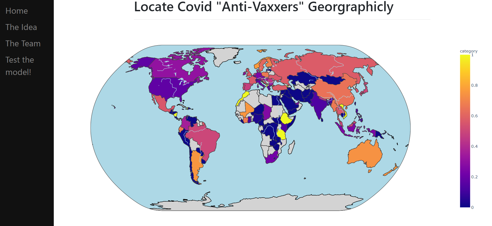

# Vaccine-nation
Deployment of NLP model to analyze Covid-19 related tweets.
This site is based on an advanced AI model developed by me and my team, and can be found in
[This repo](https://github.com/netageva/covid_tweets).
# The Idea
The coronavirus is affecting 219 countries and territories, hitting almost every country in the world. Hospitals are overflowing, unemployment rates are increasing and most countries are currently in recession. In order for the corona vaccine to be effective in controlling this world pandemic it requires herd immunity, thereby reducing the likelihood of serious illness for individuals who lack immunity or are at high risk. The goal of this project is to identify if there is a cluster of anti-vaccers in a country, so governments can proactively raise awareness and educate regarding the importance of the vaccine.

# The Site

The site allows you to view the resistance level to vaccines in every country in the world.

# How to run the code
first, clone this repo: 
`git clone https://github.com/ronlevy120/Vaccine-nation.git`
 

Then, install the requirements: 
`pip install -r requirements.txt`
 

**NOTICE: this site is build to run view Heroku, so you can't run this code locally**.
I you would like to run it locally, to must make a few changes in the code.